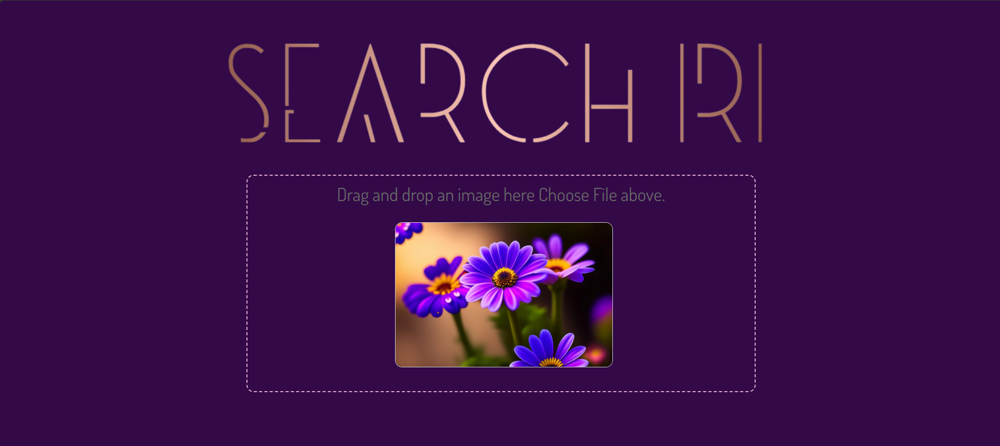
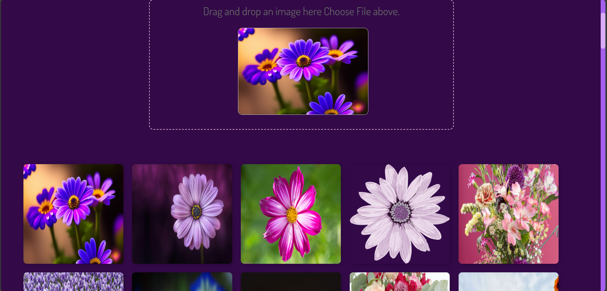

# Image Similarity Finder

## Description
Image Similarity Finder is an advanced tool that uses HOG (Histogram of Oriented Gradients) and VGG16 Deep Learning Model to extract image features and find the most similar images within a given database.

## Authors
- **AZIOUANE Khedidja**
- **SENNI Amira**

## Requirements
- **Python Version**: 3.10
- **Dependencies**:
  - TensorFlow
  - Keras
  - OpenCV
  - NumPy
  - Scikit-learn
  - Matplotlib
  - Flask

## Installation & Setup
1. Clone the repository:
   ```bash
   git clone https://github.com/AZIOUANEkhedidja/Image-Similarity-Finder.git
   cd Image-Similarity-Finder
   ```
2. Install required dependencies:
   ```bash
   pip install -r requirements.txt
   ```
3. Download the VGG16 pre-trained model and place it in the project directory:
   ```bash
   wget https://storage.googleapis.com/tensorflow/keras-applications/vgg16/vgg16_weights_tf_dim_ordering_tf_kernels.h5
   ```

## Project Structure
```
Image-Similarity-Finder/
│── app.py                  # Main Flask application
│── static/
│   ├── images/
│   │   ├── assets/
│   │   │   ├── image1.png
│   │   │   ├── image2.png
│   │   │   ├── image3.png
│── templates/              # HTML templates (if applicable)
│── requirements.txt        # Required dependencies
│── README.md               # Project documentation
```

## Example Results
Below are some example images generated by the system:

### Input Image


### Retrieved Similar Images



## Running the Application
1. Start the Flask server:
   ```bash
   python app.py
   ```
2. Open your browser and navigate to:
   ```
   http://127.0.0.1:5000/
   ```

